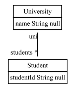

# fulibTools - Additional features for fulib.

FulibTools provides some additional features like class diagrams and object diagrams to the Fulib code generator.
These additional features require some large dependencies and as not every user benefits from them, we seperated
these additional features from Fulib into FulibTools.

## ClassDiagrams
Dump a class diagram from a ClassModel

Example:

<!-- insert_code_fragment: test4Readme.classmodel -->

      ClassModelBuilder mb = Fulib.classModelBuilder("de.uniks.studyright");
      ClassBuilder uni = mb.buildClass("University")
            .buildAttribute("name", mb.STRING);
      ClassBuilder student = mb.buildClass("Student")
            .buildAttribute("name", mb.STRING)
            .buildAttribute("studentId", mb.STRING)
            .buildAttribute("matNo", mb.INT);
      uni.buildAssociation(student, "students", mb.MANY, "uni", mb.ONE);
      ClassBuilder room = mb.buildClass("Room")
            .buildAttribute("roomNo", mb.STRING);
      uni.buildAssociation(room, "rooms", mb.MANY, "uni", mb.ONE)
            .setAggregation();
      room.buildAssociation(student, "students", mb.MANY, "in", mb.ONE);

      ClassModel model = mb.getClassModel();
 <!-- end_code_fragment: -->

You find the class diagram at:

      src/main/java/org/fulib/groupaccount/doc-files/classDiagram.png

It looks like:

The JavaDoc of e.g. the org.fulib.groupaccount.University class
may include the diagram like this:

      /**
       * 
       */
      public class University
      {
         ...
      }

## CodeFragments
Find code fragements in Java files and copy them into JavaDoc or markdown files.

Example:

In some file src/main/test/org/fulib/TestCodeFragments.java mark some
code you want to copy with

    // start_code_fragment: yourFragmentName

    code to be copied

    as many lines as you want

    // end_code_fragment:

In some file src/main/java/org/fulib/CodeFragments.java mark the
place for insertion of the code:

    /**
     * Example use:
     * <pre>
     * <!-- insert_code_fragment: yourFragmentName -->

    code to be copied

    as many lines as you want

     * <!-- end_code_fragment: yourFragmentName: -->
     * </pre>
     */
     public class CodeFragments
     {
         ...
     }

Or in e.g. Readme.md insert:

    # header
    Example:
    <!-- insert_code_fragment: yourFragmentName -->

    code to be copied

    as many lines as you want

    <!-- end_code_fragment: yourFragmentName: -->

Update the code fragements by running e.g.:
<!-- insert_code_fragment: CodeFragments.updateCodeFragments -->
               FulibTools.codeFragments().updateCodeFragments(".");
<!-- end_code_fragment: -->

### Gradle

<pre>
repositories {
    mavenCentral()
    maven { url 'https://oss.sonatype.org/content/repositories/snapshots' }
}
</pre>

<pre>
dependencies {
    testCompile 'org.fulib:fulibTools:1.0.+'
}
</pre>